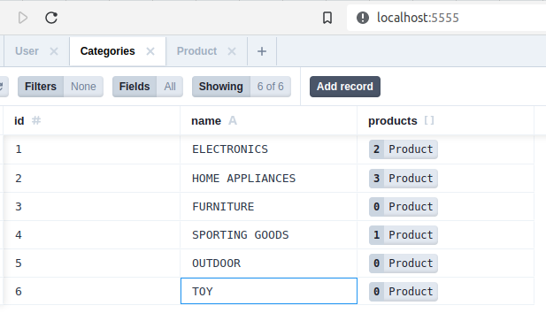

# Teebay

Teebay is a web application built with React, Apollo Client, NestJS, GraphQL, and Prisma. It allows users to browse and purchase t-shirts online. The application uses Docker Compose to manage the containers.

## Getting Started

To get started with the application, follow these steps:

1. Install Docker and Docker Compose on your machine if you haven't already done so.

2. Clone the repository to your local machine.

3. Navigate to backend and then run

```
docker-compose up
```
4. When the database is up running run
```
npm install
npm run start:dev
```
It will open up a server  at 4000.
5.Then for the frontend run this simple two commands
```
npm install
npm run 
```

For the app to run succesfully one has populate the category table like the picture. 
run this code to open prisma studio
```
npx prisma studio
```
it can be helpful see how all the queries working plus for now one can use prisma studio to make it look like the given picture.

##schema.Prisma

the given schema will give a better idea of how the relation in table are being made
```
// This is your Prisma schema file,
// learn more about it in the docs: https://pris.ly/d/prisma-schema

generator client {
  provider = "prisma-client-js"
}

datasource db {
  provider = "postgresql"
  url      = env("DATABASE_URL")
}

model User {
  id       Int     @default(autoincrement()) @id
  email    String  @unique
  name     String?
  phone    String?
  password String?
  address  String?
  productsForSale Product[] @relation("seller")
 
  productsBought Product[] @relation("buyer")
  productsRentedSE RentSystem[]@relation("renterSE")
}

model Product {
  id           Int      @default(autoincrement()) @id
  title        String
  description  String?
  price        Int
  rent         Int
  sold         Boolean?
  seller       User?    @relation("seller", fields: [sellerId], references: [id])
  sellerId     Int?
  buyer        User?    @relation("buyer", fields: [buyerId], references: [id])
  buyerId      Int?
  renterS      RentSystem[]
  rentType     String
  categories   Categories[] @relation("productCategories")
  createdAt    DateTime @default(now())
  updatedAt    DateTime @updatedAt
}

model RentSystem {
  id        Int        @default(autoincrement()) @id
  renter    User?      @relation("renterSE",fields: [renterId], references: [id])
  renterId  Int
  startTime DateTime
  endTime   DateTime
  products  Product[]
}

model Categories {
  id      Int          @default(autoincrement()) @id
  name    String
  products Product[]   @relation("productCategories")
}

```
